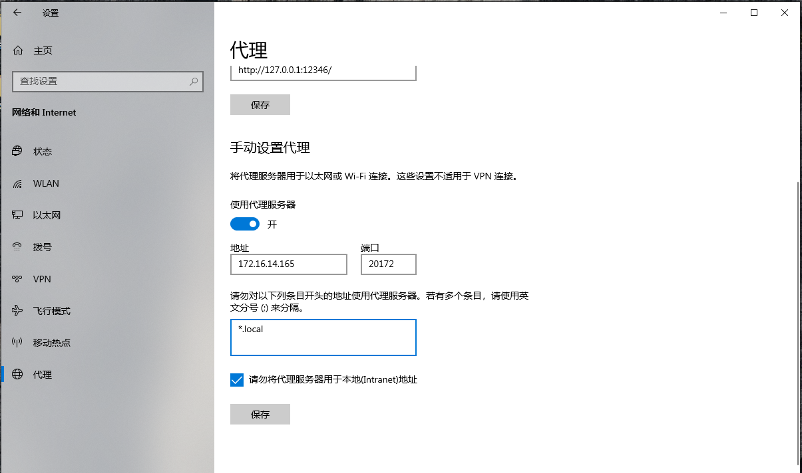

# 品艺堂代理设置

## Windows 10/11

> 注意：使用系统代理会导致盗版软件失效，如果电脑上有盗版软件，使用浏览器代理。

- 打开：`设置`
- 点击：`网络和Internet`
- 点击侧栏：`代理`
- 勾选：`使用代理服务器`
- 输入地址：`172.16.14.165`
- 输入端口：`20172`
- 勾选：`请勿将代理服务器用于本地(Intranet)地址`

## Chromium系浏览器插件

> Chromium系浏览器包括绝大多数常用浏览器，如Chrome、Edge、QQ浏览器、360浏览器等。
> 
> 使用这种方法可以只让浏览器使用代理，不影响其他软件。

[点此下载SwitchyOmega插件](http://172.16.14.165:5000/d/s/uk3drCzNqvZEiZib95M3twbE1Bw59q31/E9XspTYRzDUlgVPqfEMKu1MBK_JrRBz6-t78AgTb1qAo)

- 将`.crx`的文件的扩展名改为`.zip`，并解压到指定的文件夹。
- 打开Chrome浏览器，地址栏输入`chrome://extensions/`, 勾择开发者模式，点击'加载已解压的扩展程序'
- 选择你刚刚`.zip`文件解压所在的文件夹，点击确定。扩展程序列表出现你导入的扩展程序即为成功。

安装完成后
- 在浏览器右上角找到插件图标，
- 点击`选项`
- 在`情景模式`中选择`代理服务器`
- 在`代理协议`中选择`HTTP`
- 在`代理服务器`中填入`172.16.14.165`
- 在`端口号`中填入`20172`
- 点击`应用选项`

以后只要在插件图标中选择`代理服务器`，就可以使用代理了。

# ChatGPT使用

## 网页应用基础操作

浏览器输入网址 [http://172.16.14.165:3000](http://172.16.14.165:3000) ，新建或选择对话即可使用ChatGPT。

## 认识大语言模型（LLM）

大语言模型是人工智能领域的一个重要进展，它可以生成合理的、仿真的人类文本，这是因为它经过大量人类文本的训练。

**什么是令牌(Token)？**

在计算机语言学中，令牌（Token）是对语言中的词、标点、数字等进行的分类编码。例如，“你好，世界！”可以被分割为“你好”、“，”、“世界”、“！”等四个令牌。

**模型是如何根据上文生成新的令牌的？**

大语言模型可以理解为一个预测机器，给定一串文本，它的任务就是预测接下来的令牌。例如，如果我们给模型输入“今天的天气很”，模型可能会预测出“好”这个令牌。这种预测是基于模型在训练数据中学习到的文本模式。

**什么是上下文窗口？**

上下文窗口是模型的输入和输出最大令牌量总和。对于一个大语言模型，虽然它可以处理非常长的文本序列，但因为计算限制，它只能考虑一个有限长度的“窗口”。比如GPT-3.5的上下文窗口是4096个令牌，那么他获得的“上文”以及生成的“下文”加起来不能超过4096个令牌。

**聊天模型如何获得聊天记录？**

聊天模型通过输入的聊天对话记录来生成回应。这些记录是以“系统：...用户：...系统：...用户...”这样的形式串联起来。模型只需要将所有的对话串联起来，并将其视为一段连续的文本输入。这样，每次用户的新输入，就相当于给模型提供了更多的上下文信息，帮助模型为当前输入生成一个恰当的回应。

一般来说，聊天模型生成回应的方式和生成下一个令牌的方式是类似的。它会考虑所有以前的对话（在上下文窗口范围内），并试图预测下一个最合适的令牌，这个令牌表达了对当前输入的回应。

需要注意的是，虽然大语言模型有强大的生成能力，但由于它是根据训练数据中的模式生成文本，所以它没有理解力，也无法提供超出了训练数据范围的信息。

同时，针对聊天模型，对话的隐私是需要被严格保护的。这意味着结束一次会话后，模型不会记住之前的对话内容，每次会话对于模型来说都是全新的。

## 模型选择

默认模型为`gpt-3.5-turbo`，速度较快，价格低，但效果一般，拥有4096令牌的上下文窗口。

如果需要更好的生成内容，可以通过对话输入栏右边的小齿轮图标，找到`Model`，更改模型为`gpt-4`，价格为`gpt-3.5-turbo`的20倍，速度较慢，但效果更好，拥有8192令牌的上下文窗口。

如果需要输入大量文本，建议使用模型`gpt-3.5-turbo-16k`，该模型拥有更大的上下文窗口，能够理解更长的文本内容，拥有16384令牌的上下文窗口。

## 参数选择

- **Sampling Temperature**：该参数控制生成文本的“不确定性”或“多样性”。较高的值会导致模型生成更多的随机性和创新性，而较低的值使得模型更倾向于预测性强、常见的令牌。例如，如果你正在写一篇策划，希望模型提供一些新颖的表达，那么你可以把 sampling temperature 设置得较高。
    - 取值范围： 0到2之间

- **Nucleus Sampling (Top-p)**：这是一种文本生成策略，只在预测为最有可能的一部分令牌（它们的累积概率大于指定阈值p）中选取下一个令牌。这可以带来更多的随机性，同时还能保证生成的文本质量。比如设置成0.1，则只有概率为前10%的令牌会被生成。通常配合更高的Temperature使用。
    - 取值范围： 0到1之间

- **Max Tokens**：这个参数限制了模型所生成的文本长度，设置得过大会消耗更多的计算资源。如果你需要生成一篇较长的文章或报告，可以将该值设定得较大。但是注意一点，该参数和设置界面中另一个参数 **Token Threshold** 的数值相加不能超过模型的最大上下文窗口，否则可能导致错误。
    - 取值范围：根据模型而定

- **Presence Penalty**：这个参数用于惩罚生成已经出现过的内容，以增加生成文本的多样性。比如在创作诗歌时，你可能希望每一行都有新的内容，那么就可以提高 presence penalty 的值。负的值会让模型倾向于生成更多重复或相似的内容。
    - 取值范围：-2到2之间

- **Frequency Penalty**：这个参数用于降低生成常见词语的频率，以使生成的文本更加新颖和有趣。例如，如果你正在创作一首歌曲，希望歌词新颖独特，那么就可以提高 frequency penalty 的值。负的值会让模型使用更常见的词汇。
    - 取值范围： -2到2之间

### 连续对话参数

设置界面中的**Continuous Chat**包括了跟连续对话有关的参数设置。其中有三个连续对话模式：

- **OFF**：不要选。
- **FIFO**：FIFO是“先进先出”的缩写，这种模式适合进行长对话或主题有持续发展的对话。在这种模式下，如果对话令牌数超过模型的限制，模型会删除最早的对话记录以容纳新的对话。比如，如果你在一个购物咨询的场景下，先是询问了一些关于产品功能的问题，随着对话的深入，你又问了一些关于产品价格的问题。当达到模型的令牌限制时，与产品功能相关的早期对话内容将被删除，但是模型仍能回应最新的、关于价格方面的问题。
- **Summary**：Summary总结模式适用于误解或者引发错误的风险较高的情况，或者是在尽可能保持上下文连贯性的情况下控制对话长度。在这种模式下，模型会生成一个对之前对话内容的简短总结作为输入。这种方式能让模型获取到前面对话的要点，尽管一些细节内容可能会丢失。比如，在医疗咨询的场景下，患者可能会向模型描述多种症状，随着对话的深入，症状描绘的内容可能会非常多。在此情况下，如果启用Summary模式，模型就会生成一个关于之前症状描述的总结，这样无论对话记录有多长，模型都可以掌握到关键信息，从而做出有效的回应。

## 学会提问

设计更好的提示词不仅有助于引导语言模型的生成，也有利于改善用户体验和交互效率。以下是一些关键步骤：

- **明确思维链**：思维链是指一系列的思想、概念或事件的连续。在设计提示词时，需要明确其目标和用户的需求。例如，如果您的目标是让大语言模型帮助您设计展览的布局，那么您可能需要考虑的思维链包括：展览的主题是什么？目标观众是谁？展示的内容有哪些？各个展项之间的逻辑关系是什么等。

- **设定角色**：为大语言模型设定特定的角色，可以帮助它生成更符合期望的回答。例如，您可以告诉模型，它是一个经验丰富的展览策划师，会提供专业的展览策划建议。

- **输入/输出格式设定**：明确的输入/输出格式可以让用户更清楚地理解如何与模型交互，也可以让模型的回答更合适。例如，你可以设定问题以“我想知道…”开始，回答以“您可以…”开始。

在设计提示词时，请确保它们具有指导性和特定的上下文，这有助于语言模型产生更具体和相关的响应。同时，记住，测试和反馈是改善提示词的关键。不断试验，根据模型的反馈和用户的反馈来调整你的提示词。

例如，在设计一个以未来科技为主题的博物馆时，仅仅输入“帮我写一篇未来科技主题博物馆的策划案”很难让模型产生高质量的输出，或很难生成符合甲方要求的内容。可以尝试以上的几个方法，优化提示词。下面是一个例子：

“作为一个经验丰富的博物馆策划师，你需要策划一家专门展示未来科技的博物馆。这个博物馆的目标观众包括科技爱好者，学生和科研人员。展览将包括虚拟现实技术，人工智能机器人和量子计算机等元素，整体布局和设计需要在预算范围内同时符合安全标准。希望你能给出如何将这些复杂的科技元素融入设计使观众有直观感受，以及如何创建有意义、有教育意义的体验给所有年龄段的观众。以Markdown格式排版并输出博物馆的策划大纲。”

具体的提示词可以根据甲方需求以及思维导图来调整。

除了提示词设计，以下的提问方法也可以帮助你更好地使用AI生成回答：

1. **设定明确的目标**：在你提问之前，要明确你的问题目标是什么。你是希望得到一个具体的答案，还是想要得到一个更深层次的理解，或者是希望被正确地引导。

2. **提供足够的上下文**：连贯的问题总是建立在相关上下文上的，尽可能地提供上下文信息能帮助你得到更精确的答案。

3. **明确和具体**：如果你对答案有特殊期待，那么你的问题需要尽可能的明确和具体。模糊的提问可能导致模糊的答案。

4. **使用开放式问题**：当你想要获取更多信息，发掘新的观点时，使用开放式问题更有利于引出丰富的答案。

5. **考虑问题的顺序**：先简单后复杂，先广泛后具体，这样的提问顺序可以帮助你逐步深入到问题的核心。

6. **验证理解**：确认你已经完全理解了答案，如果有不清楚的地方就及时提问。
